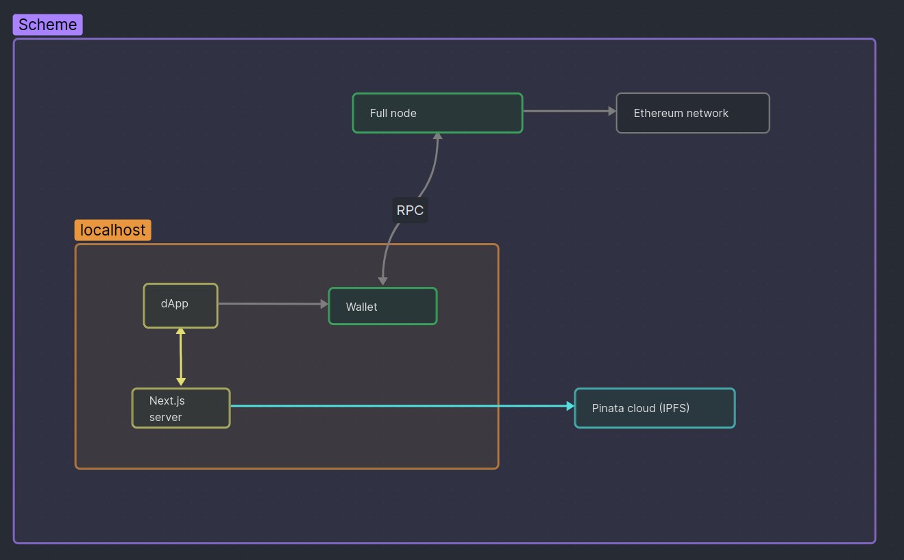
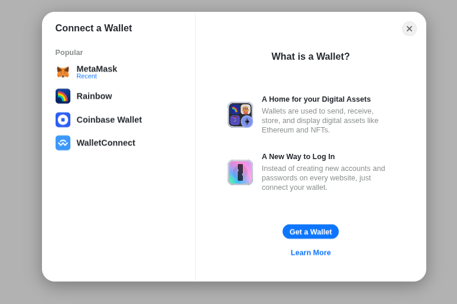
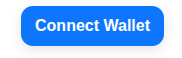
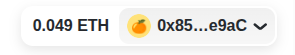
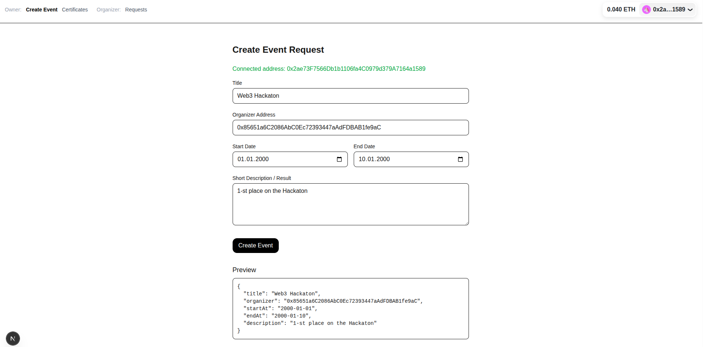
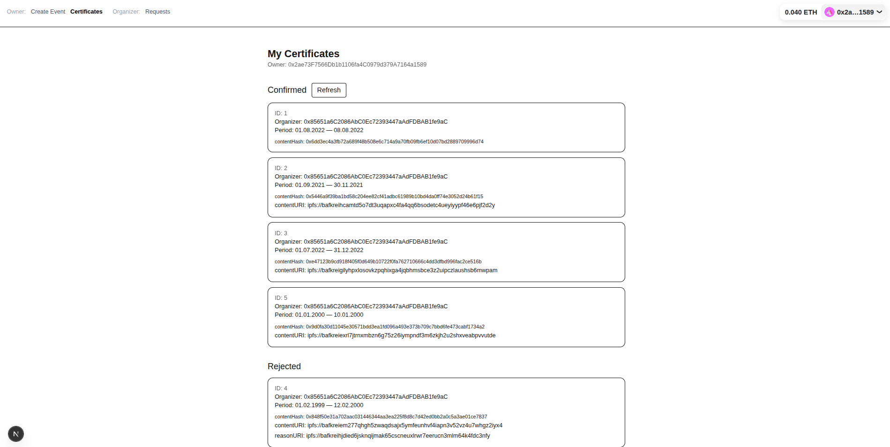
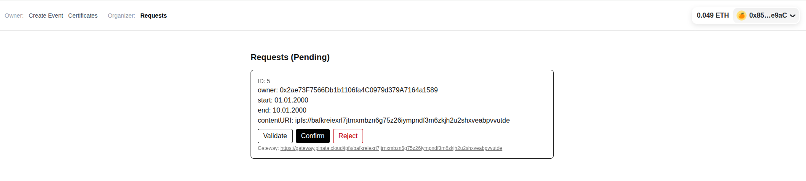

# 📂 portfolio-dapp

This project demonstrates interaction between a **Portfolio Owner** and an **Organizer** (a company or employee).  
It is built with **Next.js**, **wagmi/viem**, and integrates **IPFS via Pinata** for storing event data.




## User Story

The application has **two roles**:

- **Owner** – creates event requests
- **Organizer** – reviews and confirms/rejects those requests

To use the app:
1. Connect your wallet (e.g., MetaMask).  
2. Choose whether you act as **Owner** or **Organizer** by connecting with the appropriate wallet.  





### 👤 Owner Workflow
- Creates a new event request.
- Each event includes metadata stored on **IPFS** (via Pinata).


- **Confirmed** events become certificates visible to the Owner.  
- Each certificate contains a `contentURI` pointing to IPFS data.  
- Rejected events also include a `reasonURI` explaining the rejection.  


### 🏢 Organizer Workflow
- Sees all pending event requests.  
- Can **confirm** or **reject** a request.  


### 📜 Certificates
- **Confirmed** events become certificates visible to the Owner.  
- Each certificate contains a `contentURI` pointing to IPFS data.  
- Rejected events also include a `reasonURI` explaining the rejection. 


All content is stored on **[Pinata](https://app.pinata.cloud)** (IPFS).


## Running locally

### 1. Deploy Smart Contract
Deploy the contract from [`contracts/portfolio.sol`](contracts/portfolio.sol) to an Ethereum testnet (e.g., Sepolia).

### 2. Configure Environment
Create a `.env.local` file with the following:

```bash
NEXT_PUBLIC_WALLETCONNECT_PROJECT_ID=<your_project_id>
PINATA_JWT=<your_jwt>
PINATA_GATEWAY=https://gateway.pinata.cloud/ipfs/
```

**[Pinata](https://app.pinata.cloud)** - for IPFS storage
**[WalletConnect](https://dashboard.reown.com/sign-in)** - for connecting wallets

### 3. Install & Run

```bash
npm install
npm run dev
```

App will be available on localhost:3000


